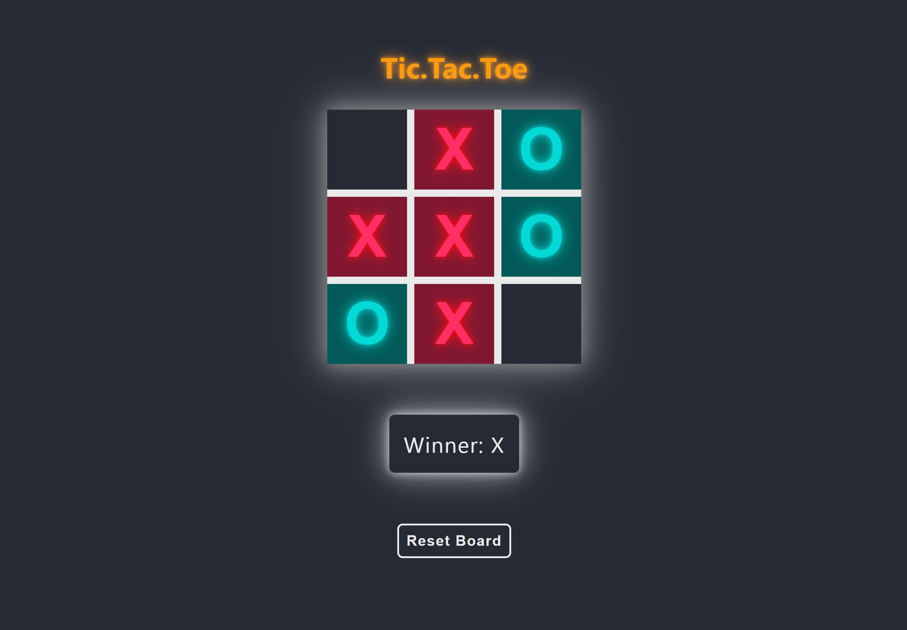

# tic.tac.toe
a react demo

## Overview

This is a game of tic tac toe created with ReactJS and is based off of the <a href="https://reactjs.org/tutorial/tutorial.html" rel="noopener noreferrer" target="_blank">tutorial provided by the reactjs.org</a> documentation. It has been slightly customized and features new UI and animations. 
It is built with: <ul><li>HTML5</li><li>CSS3</li><li>JavaScript ES6</li><li>Create-React-App</li></ul>
You can try out the live site at <a href="https://guthribm.github.io/tic-tac-toe/" rel="noopener noreferrer" target="_blank">https://guthribm.github.io/tic-tac-toe/</a>
